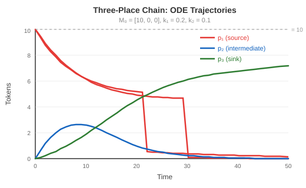

# From Discrete to Continuous

**Learning objective**: Convert a Petri net into an ODE system and understand why this is powerful.

The previous chapter gave you a toolkit for analyzing Petri nets: incidence matrices, state equations, P-invariants. All of that works by tracking integer tokens through discrete firing events. This chapter shows what happens when you let go of the integers — when tokens become real-valued concentrations and transitions fire continuously at rates determined by the net's structure. The state equation becomes a differential equation, and the entire apparatus of calculus becomes available.

## Why Discrete Event Simulation Hits Walls

Discrete Petri net simulation is straightforward. Pick an enabled transition. Fire it. Update the marking. Repeat.

For small nets this works fine. But as systems grow, three problems compound:

**Event volume scales with population.** A hospital ER with 10 patients might generate 50 events (arrivals, triages, consultations, discharges). The same ER with 10,000 patients generates 500,000 events. Each event must be processed sequentially — check which transitions are enabled, choose one, fire it, update the marking, record the event. The cost scales linearly with the number of tokens moving through the system.

**State space explodes.** The reachability set $R(M_0)$ grows combinatorially with the number of tokens and places. A net with 10 places and 100 total tokens can have astronomical numbers of reachable markings. Enumerating them becomes infeasible long before the model is "large" by real-world standards.

**Individual identity is usually irrelevant.** Discrete simulation tracks which specific token moved where. But for capacity planning, bottleneck analysis, or throughput estimation, you don't care about Patient 47. You care about how many patients are waiting, on average, and how fast the queue drains. Tracking individuals is expensive bookkeeping for information you don't need.

The continuous approach dissolves all three problems. Tokens become real numbers — concentrations, not counts. Transitions fire continuously at rates determined by the current state. The evolution of the system is described by a set of ordinary differential equations (ODEs) that can be solved in milliseconds regardless of the population size.

## Mass-Action Kinetics

The bridge from discrete to continuous comes from chemistry, where it's called **mass-action kinetics**: the rate of a reaction is proportional to the product of the concentrations of its reactants.

Consider a transition $t$ with rate constant $k$ and two input places $p_1$ and $p_2$:

```
[p1] --> t[k] --> [p3]
[p2] --/
```

In the discrete world, $t$ fires when both $p_1$ and $p_2$ have at least one token. In the continuous world, $t$ fires at a **rate** that depends on how many tokens are in its inputs:

$$v(t) = k \cdot M(p_1) \cdot M(p_2)$$

More tokens in the input places means a higher firing rate. Zero tokens in any input place means zero rate — the transition stalls. This is the continuous analog of the enabling condition: instead of a binary enabled/disabled, you get a smooth rate that goes to zero as inputs deplete.

### The General Rate Law

For a transition $t$ with rate constant $k(t)$, input places $p_1, p_2, \ldots, p_r$, and arc weights $w_1, w_2, \ldots, w_r$:

$$v(t, M) = k(t) \cdot \prod_{i=1}^{r} M(p_i)^{w_i}$$

The firing rate is the rate constant times the product of input markings, each raised to the power of its arc weight. An arc weight of 1 gives linear dependence (the common case). An arc weight of 2 gives quadratic dependence — the rate grows with the square of the concentration, modeling reactions that require two units of the same resource.

### Why This Works

Mass-action kinetics isn't just a convenient formula: it's the natural rate law when transitions fire at random with probability proportional to the availability of inputs. If a transition needs one token from $p_1$ and one from $p_2$, and tokens are selected at random, the probability of a successful firing scales as $M(p_1) \times M(p_2)$.

Chemistry discovered this in the 19th century. The same logic applies to any system where events happen stochastically and depend on resource availability: customers joining queues, orders consuming inventory, players taking turns.

## The Continuous Relaxation

With mass-action rates defined, we can write the ODE system for any Petri net. Recall the incidence matrix $C$ from Chapter 2, where $C[i,j]$ is the net change in place $p_i$ when transition $t_j$ fires. Collect all transition rates into a vector:

$$v(M) = [v(t_1, M), v(t_2, M), \ldots, v(t_m, M)]^T$$

The **continuous state equation** is:

$$\frac{dM}{dt} = C \cdot v(M)$$

This says: the rate of change of the marking is the incidence matrix times the rate vector. Each place's token count changes by the weighted sum of all transition rates affecting it. Tokens flow in from transitions that produce, and flow out to transitions that consume.

### Example: Three-Place Chain

The simplest non-trivial example:

```
[p1] -> t1[k1] -> [p2] -> t2[k2] -> [p3]
```

Incidence matrix and rate vector:

$$C = \begin{bmatrix} -1 & 0 \\ 1 & -1 \\ 0 & 1 \end{bmatrix}, \quad v(M) = \begin{bmatrix} k_1 \cdot M(p_1) \\ k_2 \cdot M(p_2) \end{bmatrix}$$

The ODE system:

$$\frac{dM(p_1)}{dt} = -k_1 \cdot M(p_1)$$

$$\frac{dM(p_2)}{dt} = k_1 \cdot M(p_1) - k_2 \cdot M(p_2)$$

$$\frac{dM(p_3)}{dt} = k_2 \cdot M(p_2)$$

Starting from $M_0 = [10, 0, 0]^T$ with $k_1 = 0.2$ and $k_2 = 0.1$:



- Tokens drain from $p_1$ exponentially: $M(p_1, t) = 10 \cdot e^{-0.2t}$
- Tokens build up in $p_2$, then drain to $p_3$
- Eventually all tokens accumulate in $p_3$

The conservation law still holds — $M(p_1) + M(p_2) + M(p_3) = 10$ for all time — because $[1, 1, 1] \cdot C = [0, 0]$. Tokens aren't created or destroyed, just redistributed continuously.

### What Changes, What Stays

The continuous relaxation changes the execution model (real-valued tokens, rate-based firing) but preserves the structural properties:

- **Conservation laws** still hold. If $w^T \cdot C = \vec{0}$ in the discrete case, the same identity holds in the continuous case, and the weighted token sum is constant for all time.
- **The incidence matrix** is identical. The structure of the net doesn't change.
- **Boundedness** from P-invariants still applies.

What you gain is speed and scalability. Solving the ODE system takes the same time whether you start with 10 tokens or 10,000. And the solution gives you a smooth trajectory — the entire evolution of the system, not just a sequence of discrete snapshots.

What you lose is individual identity. Token 47 no longer exists. You have 4.3 tokens in $p_2$ — a concentration, an average, a continuous quantity. For most modeling purposes, this is exactly the right trade-off.

## Numerical Integration

Most ODE systems can't be solved analytically. Even the three-place chain above has a closed-form solution only because it's linear. Add a synchronization transition (two inputs) and the system becomes nonlinear — the rate depends on the product of two state variables. Analytical solutions vanish.

Instead, we solve numerically: start at the initial marking, compute the derivatives, step forward in time, repeat.

### Euler's Method (and Why It's Not Enough)

The simplest numerical method is Euler's method:

$$M_{n+1} = M_n + h \cdot f(t_n, M_n)$$

Where $h$ is the timestep and $f(t, M) = C \cdot v(M)$ is the derivative function. Compute the slope, take a step in that direction.

Euler's method works but is inaccurate. The error grows as $O(h)$ — to halve the error, you must halve the timestep and double the work. For Petri net simulations with rates spanning several orders of magnitude, tiny timesteps are needed, making Euler impractically slow.

### Runge-Kutta Methods

The standard remedy is to evaluate the derivative at multiple points within each step and combine them for a better approximation. These are **Runge-Kutta methods**, and they're classified by their *order* — the power of $h$ in the error term.

A 4th-order method (RK4) has error $O(h^5)$ per step. A 5th-order method has error $O(h^6)$. Higher order means fewer steps for the same accuracy.

### Tsit5: What go-pflow Uses

The default solver in go-pflow is **Tsit5** — a 5th-order Runge-Kutta method designed by Charalampos Tsitouras in 2011. It uses 7 function evaluations per step to compute both a 5th-order solution and a 4th-order solution. The difference between them estimates the error.

This error estimate enables **adaptive timestep control**:

1. Compute both the 5th-order and 4th-order solutions
2. Estimate the error: $\varepsilon = \|M_5 - M_4\|$
3. If $\varepsilon < \text{tolerance}$: accept the step, try a larger step next time
4. If $\varepsilon \geq \text{tolerance}$: reject the step, retry with a smaller step

The solver automatically takes large steps where the solution is smooth and small steps where it changes rapidly. You specify the error tolerance, not the timestep. This is why the same solver handles both a slow-draining reservoir and rapid chemical kinetics without manual tuning.

In code:

```go
net, rates := petri.Build().
    Place("A", 10).Place("B", 0).Place("C", 0).
    Transition("t1").Transition("t2").
    Arc("A", "t1", 1).Arc("t1", "B", 1).
    Arc("B", "t2", 1).Arc("t2", "C", 1).
    WithRates(1.0)

prob := solver.NewProblem(net, net.SetState(nil), [2]float64{0, 50}, rates)
sol := solver.Solve(prob, solver.Tsit5(), solver.DefaultOptions())

final := sol.GetFinalState()
// final["A"] ~= 0.0, final["C"] ~= 10.0
```

The `Tsit5()` solver, `DefaultOptions()` tolerance settings, and the mass-action kinetics built into `NewProblem` handle everything. The user specifies the net, the rates, and the time span. The solver does the rest.

### Other Solvers

go-pflow provides several Runge-Kutta methods for different use cases:

| Solver | Order | Use Case |
|--------|-------|----------|
| `Tsit5()` | 5(4) | Default — best balance of speed and accuracy |
| `RK45()` | 5(4) | Dormand-Prince — the classic MATLAB `ode45` |
| `BS32()` | 3(2) | Bogacki-Shampine — faster per step, less accurate |
| `RK4()` | 4 | Classic fixed-step — no adaptive control |
| `Euler()` | 1 | Forward Euler — educational only |

For most Petri net simulations, Tsit5 is the right choice. RK45 produces nearly identical results. The lower-order methods exist for comparison and for systems where function evaluations are extremely expensive.

### Solver Presets

Rather than manually tuning tolerances, go-pflow provides presets for common scenarios:

```go
solver.DefaultOptions()    // General purpose (Dt=0.01, Reltol=1e-3)
solver.FastOptions()       // Game AI, interactive (Dt=0.1, Reltol=1e-2)
solver.AccurateOptions()   // Research, publishing (Dt=0.001, Reltol=1e-6)
solver.JSParityOptions()   // Match pflow.xyz JS solver exactly
```

The `FastOptions` preset trades precision for speed — about 10x faster, suitable for game AI where you need many evaluations per second. `AccurateOptions` tightens tolerances for publication-quality results.

## Equilibrium Detection

Many systems settle into a steady state where nothing changes anymore. The ODE solver can detect this automatically.

**Equilibrium** means:

$$\frac{dM}{dt} = C \cdot v(M^*) = \vec{0}$$

All derivatives are zero. Tokens still exist, but the flow in equals the flow out at every place. The system has reached a balance.

For the three-place chain, equilibrium is $M^* = [0, 0, 10]^T$ — all tokens have moved to $p_3$ and no transitions can fire (both input places are empty, so both rates are zero). This is a **terminal equilibrium** — the system has stopped.

Other nets reach **dynamic equilibrium** where transitions still fire but the marking doesn't change. A net with a cycle:

```
[p1] -> t1[k1] -> [p2] -> t2[k2] -> [p1]
```

reaches equilibrium when $k_1 \cdot M(p_1) = k_2 \cdot M(p_2)$ — the flow from $p_1$ to $p_2$ equals the flow back. The tokens are still moving, but the concentrations are stable.

### Why Equilibrium Matters

Equilibrium tells you the long-run behavior of the system:

**Capacity planning.** A hospital ER at equilibrium has stable queue lengths. Those lengths tell you whether you have enough doctors, whether patients wait too long, whether the system is overloaded.

**Bottleneck identification.** At equilibrium, tokens accumulate before the slowest transition. A place with a high equilibrium concentration is a bottleneck — work piles up there because the downstream transition can't keep up.

**Optimization.** The equilibrium value of an objective function (profit, throughput, win probability) tells you how good a configuration is. Change a rate constant, re-solve to equilibrium, compare.

### In Code

go-pflow can solve until equilibrium is detected, stopping early instead of integrating to an arbitrary end time:

```go
prob := solver.NewProblem(net, initialState, [2]float64{0, 1000}, rates)

sol, result := solver.SolveUntilEquilibrium(
    prob,
    solver.Tsit5(),
    solver.DefaultOptions(),
    solver.DefaultEquilibriumOptions(),
)

if result.Reached {
    fmt.Printf("Equilibrium at t=%.2f\n", result.Time)
    fmt.Printf("Final state: %v\n", result.State)
    fmt.Printf("Max rate of change: %e\n", result.MaxChange)
}
```

The equilibrium detector monitors the maximum absolute derivative across all places. When it stays below a tolerance (default $10^{-6}$) for several consecutive steps, the solver declares equilibrium and stops. Presets control the sensitivity:

```go
solver.DefaultEquilibriumOptions()  // Tolerance 1e-6, 5 consecutive steps
solver.FastEquilibriumOptions()     // Tolerance 1e-4, 3 steps (game AI)
solver.StrictEquilibriumOptions()   // Tolerance 1e-9, 10 steps (research)
```

## The Full Picture

The continuous relaxation transforms the Petri net from a discrete-event system into a dynamical system. The incidence matrix becomes the stoichiometry matrix. The firing rule becomes mass-action kinetics. The state equation becomes a differential equation.

This transformation is faithful — conservation laws, structural bounds, and topology carry over unchanged. But the continuous form is dramatically more efficient to simulate and opens the door to equilibrium analysis, sensitivity analysis, and gradient-based optimization.

The pattern for using continuous Petri nets is:

1. **Build the net** — places, transitions, arcs (same as discrete)
2. **Assign rates** — a rate constant $k$ for each transition
3. **Solve the ODE** — from initial marking to final time or equilibrium
4. **Read the results** — token trajectories, equilibrium values, conservation checks

The remaining chapters in this book use this pattern extensively. The coffee shop in Chapter 5 uses equilibrium analysis for capacity planning. The knapsack problem in Chapter 8 uses continuous relaxation to approximate discrete optimization. The enzyme kinetics in Chapter 9 recover classical biochemistry equations directly from the net's structure.

Every time, the steps are the same: define the net, set the rates, solve, interpret. The mathematics is always $dM/dt = C \cdot v(M)$. The solver handles the numerics. You focus on the model.
