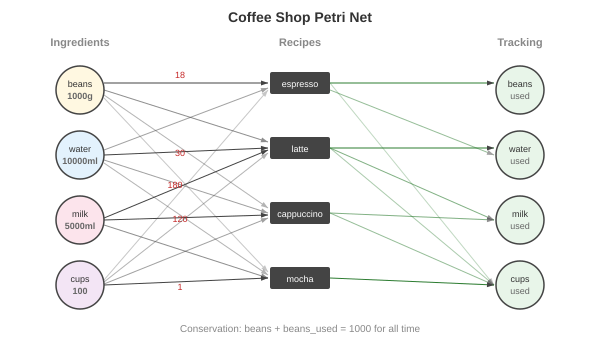

# Resource Modeling — The Coffee Shop

**Learning objective**: Model inventory, throughput, and bottlenecks as token flow.

The first four chapters built the machinery: bipartite graphs, incidence matrices, ODEs, a DSL. Now we use it. This chapter models a coffee shop — ingredients, recipes, orders, capacity limits — as a Petri net. The model answers operational questions: When do we run out of beans? Which drink creates the worst bottleneck? How should we staff during peak hours?

The coffee shop is a **ResourceNet** in the categorical vocabulary from Chapter 4. Tokens represent fungible quantities — grams of beans, milliliters of milk, cups. Conservation laws guarantee that nothing is created or destroyed without an explicit transition. The continuous relaxation from Chapter 3 turns the model into a capacity planning tool.

## The Problem

A coffee shop has limited inventory. Different drinks consume ingredients at different rates:

| Drink | Beans | Water | Milk | Syrup | Cups |
|-------|-------|-------|------|-------|------|
| Espresso | 18g | 30ml | — | — | 1 |
| Americano | 18g | 200ml | — | — | 1 |
| Latte | 18g | 30ml | 180ml | — | 1 |
| Cappuccino | 18g | 30ml | 120ml | — | 1 |
| Mocha | 18g | 30ml | 150ml | 2 pumps | 1 |

Starting inventory: 1,000g beans, 5,000ml milk, 10,000ml water, 500 pumps of syrup, 100 cups.

The questions are straightforward. Which ingredient runs out first? How many drinks can we serve before something depletes? If we increase latte production, what's the knock-on effect on bean consumption?

You could answer these with a spreadsheet. But a spreadsheet gives you static arithmetic — multiply rates by time. A Petri net gives you *dynamics* — rates that change as resources deplete, multiple transitions competing for the same inputs, bottlenecks emerging from structure rather than being hard-coded.

## Defining the Net

The coffee shop net has three categories of places:

**Ingredient places** hold the current stock. Each starts with an initial token count representing the inventory on hand:

```
coffee_beans: 1000    (grams)
milk:         5000    (milliliters)
water:        10000   (milliliters)
cups:         100
syrup:        500     (pumps)
```

**Consumption tracking places** count what's been used. They start at zero and accumulate as drinks are made:

```
beans_used:  0
milk_used:   0
water_used:  0
cups_used:   0
syrup_used:  0
```

**Transitions** represent drink preparation — one per drink type:

```
make_espresso
make_americano
make_latte
make_cappuccino
make_mocha
```



The bipartite structure is clean: ingredient places connect to transitions (input arcs), and transitions connect to tracking places (output arcs). No place connects to another place. No transition connects to another transition. The Petri net enforces this separation by construction.

### In Code

The code in this chapter is adapted from `NewInventoryNet` in go-pflow's [`examples/coffeeshop/inventory.go`](https://github.com/pflow-xyz/go-pflow/blob/main/examples/coffeeshop/inventory.go). That net is larger than the one built here: it adds an iced latte (200ml milk), a sugar-packet condiment and a refill transition for every ingredient. The chapter keeps the five drinks in the table above, so its numbers are for the five-drink net.

```go
net := petri.NewPetriNet()

// Ingredient places
net.AddPlace("coffee_beans", 1000, nil, 100, 100, nil)
net.AddPlace("milk", 5000, nil, 100, 200, nil)
net.AddPlace("water", 10000, nil, 100, 300, nil)
net.AddPlace("cups", 100, nil, 100, 400, nil)
net.AddPlace("syrup", 500, nil, 100, 600, nil)

// Tracking places
net.AddPlace("beans_used", 0, nil, 300, 100, nil)
net.AddPlace("milk_used", 0, nil, 300, 200, nil)
net.AddPlace("water_used", 0, nil, 300, 300, nil)
net.AddPlace("cups_used", 0, nil, 300, 400, nil)
net.AddPlace("syrup_used", 0, nil, 300, 600, nil)
```

Each place gets an initial token count. The tracking places start at zero — they're sinks that accumulate evidence of consumption. Together with the ingredient places, they form a conservation system: every bean consumed from `coffee_beans` appears in `beans_used`.

## Weighted Arcs as Recipes

Each drink requires specific quantities of ingredients. The arc weights encode these recipes directly in the net's structure.

For espresso — 18g beans, 30ml water, 1 cup:

```go
net.AddTransition("make_espresso", "consume", 200, 150, nil)

// Input arcs (consumption)
net.AddArc("coffee_beans", "make_espresso", 18, false)
net.AddArc("water", "make_espresso", 30, false)
net.AddArc("cups", "make_espresso", 1, false)

// Output arcs (tracking)
net.AddArc("make_espresso", "beans_used", 18, false)
net.AddArc("make_espresso", "water_used", 30, false)
net.AddArc("make_espresso", "cups_used", 1, false)
```

For a latte — 18g beans, 30ml water, 180ml milk, 1 cup:

```go
net.AddTransition("make_latte", "consume", 200, 350, nil)

net.AddArc("coffee_beans", "make_latte", 18, false)
net.AddArc("water", "make_latte", 30, false)
net.AddArc("milk", "make_latte", 180, false)
net.AddArc("cups", "make_latte", 1, false)

net.AddArc("make_latte", "beans_used", 18, false)
net.AddArc("make_latte", "water_used", 30, false)
net.AddArc("make_latte", "milk_used", 180, false)
net.AddArc("make_latte", "cups_used", 1, false)
```

The arc weight from `milk` to `make_latte` is 180. This means `make_latte` is enabled only when $M(\text{milk}) \geq 180$. Each firing consumes 180 tokens from milk and produces 180 tokens in milk_used. The recipe *is* the arc structure — no separate configuration needed.

### The Incidence Matrix

The incidence matrix for the full model captures every recipe in a single data structure. Each column is a drink type. Each row is an ingredient (or tracking place). Reading column `make_latte`:

$$C[\text{coffee\_beans}, \text{make\_latte}] = -18$$
$$C[\text{milk}, \text{make\_latte}] = -180$$
$$C[\text{water}, \text{make\_latte}] = -30$$
$$C[\text{cups}, \text{make\_latte}] = -1$$

Negative entries are consumption. Positive entries in the tracking rows mirror them:

$$C[\text{beans\_used}, \text{make\_latte}] = +18$$
$$C[\text{milk\_used}, \text{make\_latte}] = +180$$

### Conservation Laws

The paired structure — every token consumed from an ingredient place appears in the corresponding tracking place — creates P-invariants. For coffee beans:

$$M(\text{coffee\_beans}) + M(\text{beans\_used}) = 1000$$

For milk:

$$M(\text{milk}) + M(\text{milk\_used}) = 5000$$

These hold for all time, under any firing sequence. The conservation law is structural — it follows from the arc weights summing to zero across each ingredient/tracking pair. No beans are created or destroyed. They're consumed from stock into the "used" counter.

This is the Petri net equivalent of double-entry bookkeeping. Every debit (consumption) has a matching credit (tracking). The invariant is the balance equation.

## ODE Simulation for Capacity Planning

With the net defined, the continuous relaxation from Chapter 3 turns it into a dynamical system. Each transition gets a rate constant; `InventoryRates()` in `inventory.go` labels them drinks per minute at peak:

```go
rates := map[string]float64{
    "make_espresso":   0.5,  // 30/hr
    "make_americano":  0.3,  // 18/hr
    "make_latte":      0.8,  // 48/hr — most popular
    "make_cappuccino": 0.4,  // 24/hr
    "make_mocha":      0.2,  // 12/hr
}
```

go-pflow's solver ([`solver/ode.go`](https://github.com/pflow-xyz/go-pflow/blob/main/solver/ode.go)) computes each transition's flux as its rate constant times the *first* power of every input place, and the arc weight scales only how much each firing consumes:

<div>$$v(\text{make\_latte}) = k_{\text{latte}} \cdot M(\text{beans}) \cdot M(\text{water}) \cdot M(\text{milk}) \cdot M(\text{cups})$$</div>

<div>$$\frac{dM(\text{milk})}{dt} = -180\,v(\text{make\_latte}) - 120\,v(\text{make\_cappuccino}) - 150\,v(\text{make\_mocha})$$</div>

The weight 18 on the bean arc does not become an 18th power; chemistry's mass-action law would raise each input to its stoichiometric coefficient, and go-pflow deliberately does not.

### Scaling for Stability

Even with first powers, the product of four or five large stocks is enormous: 1,000 × 10,000 × 5,000 × 100 for a latte. Mass-action kinetics was designed for chemical concentrations, which are small numbers; coffee shop inventory has large integer token counts. The example's [`simulation.go`](https://github.com/pflow-xyz/go-pflow/blob/main/examples/coffeeshop/simulation.go) multiplies every rate constant by the same small factor:

```go
scaledRates := make(map[string]float64)
for k, v := range rates {
    scaledRates[k] = v * 0.0001
}

prob := solver.NewProblem(net, initialState, [2]float64{0, duration}, scaledRates)
opts := solver.DefaultOptions()
opts.Dt = 0.001

sol, eqResult := solver.SolveUntilEquilibrium(
    prob, solver.Tsit5(), opts, nil,
)
```

Multiplying every rate constant by the same factor stretches the time axis and changes nothing else: the trajectory passes through the same markings in the same order, only on a different clock. The example's comment gives numerical stability as the reason for the scaling; mathematically, it is a choice of time units.

What scaling cannot undo is the reweighting the product causes. Because the stocks multiply into the flux, a drink's ODE flux depends on how many ingredients it uses, not just on its $k$. At the initial marking (derived by hand from the rate law, not re-run):

- $v(\text{make\_latte}) / v(\text{make\_espresso}) = (0.8 \times 5000) / 0.5 = 8000$, from latte's extra milk factor
- $v(\text{make\_mocha}) / v(\text{make\_latte}) = (0.2 \times 500) / 0.8 = 125$, from mocha's extra syrup factor

So in the ODE the rate constants are not drinks per minute, and the drink mix is not 0.8 lattes to every 0.5 espressos. The drinks-per-minute reading belongs to the linear estimate in the next section.

### What the Model Predicts

Which stock goes first follows from how much of each stock a single drink takes. A milk drink takes 120–180ml of 5,000ml milk (2.4–3.6%), 18g of 1,000g beans (1.8%), one of 100 cups (1%) and 30ml of 10,000ml water (0.3%). The ordering is:

- **Milk** goes first. Three of the five drinks draw on it, about 222ml per minute at the baseline rates, so 5,000ml lasts roughly 23 minutes on the linear estimate. As milk runs low, all three milk drinks stall, because milk is a factor in each of their fluxes.
- **Coffee beans** go next. Every drink uses 18g, 1,000g supports about 55 drinks, and once the milk drinks stall only espresso and americano still draw on them.
- **Cups** never come close. 100 cups at 2.2 drinks per minute would last 45 minutes if nothing else ran out, but milk and then beans run out first.
- **Water** lasts longest: 10,000ml, with every drink except the americano using 30ml.

Cups are the smallest number, so intuition says they go first. They do not, because the weights decide it: a latte takes 180 tokens of milk and one token of cups.

Under product kinetics no place reaches exactly zero. Each stock decays toward zero and every transition that reads it slows down with it, so "goes first" here means "falls fastest". The minute figures above are linear estimates. A committed ODE run that gives the same order, with its own clock, is not yet part of the example.

The conservation laws hold at every point of an ODE trajectory, because the solver adds $18v$ to `beans_used` for every $18v$ it takes from `coffee_beans`:

$$M(\text{coffee\_beans}) + M(\text{beans\_used}) = 1000$$

Checking this sum in the solver output is a quick test that the arcs were wired correctly.

### Predicting Runout

Rather than running the full ODE, we can estimate depletion times from the rates and arc weights, reading each rate constant as drinks per minute. This is a condensed version of `PredictRunout` in `simulation.go`, which also covers the iced latte, water and sugar:

```go
consumptionRates := map[string]float64{
    "coffee_beans": 18 * (rates["make_espresso"] +
                          rates["make_americano"] +
                          rates["make_latte"] +
                          rates["make_cappuccino"] +
                          rates["make_mocha"]),
    "milk": 180*rates["make_latte"] +
            120*rates["make_cappuccino"] +
            150*rates["make_mocha"],
    "cups": rates["make_espresso"] +
            rates["make_americano"] +
            rates["make_latte"] +
            rates["make_cappuccino"] +
            rates["make_mocha"],
    "syrup": 2 * rates["make_mocha"],
}

for ingredient, rate := range consumptionRates {
    runoutTime := currentStock[ingredient] / rate
    fmt.Printf("%s depletes in %.0f minutes\n", ingredient, runoutTime)
}
```

With the baseline rates the arithmetic can be checked by hand:

| Ingredient | Draw per minute | Stock | Linear runout |
|---|---|---|---|
| milk | 180(0.8) + 120(0.4) + 150(0.2) = 222 ml | 5,000 ml | ≈ 23 min |
| coffee_beans | 18 × 2.2 = 39.6 g | 1,000 g | ≈ 25 min |
| cups | 2.2 | 100 | ≈ 45 min |
| water | 30(0.5 + 0.8 + 0.4 + 0.2) + 200(0.3) = 117 ml | 10,000 ml | ≈ 85 min |
| syrup | 2 × 0.2 = 0.4 pumps | 500 | ≈ 1,250 min |

The linear estimate assumes every drink keeps its rate until a stock hits zero. The ODE instead slows each transition as its inputs decline. The two should agree on the order, which follows from the per-drink fractions above, but not on the timings. In this model they do not even share a clock, because the ODE's rate constants are not drinks per minute (see "Scaling for Stability").

## Bottleneck Analysis from Equilibrium

When the ODE reaches steady state ($dM/dt = 0$), the marking shows where tokens are left over, and the path to that state shows the order in which the bottlenecks hit.

In the coffee shop, equilibrium means every drink transition has stalled because at least one of its inputs is near zero. Water, cups and syrup are still on hand at that point. The bottleneck sequence is:

1. **First bottleneck**: Milk (three drinks, heavy weights — 222ml/min at baseline)
2. **Second bottleneck**: Beans (every drink needs 18g, and after the milk drinks stall, espresso and americano keep drawing on them)
3. **Cups and water** never become the bottleneck at these rates

### Scenario Analysis

Change the rates to model different days. The minute figures below are linear estimates, computed from the table above:

**Slow day** — halve all rates:
```go
rates["make_latte"] = 0.4  // 24/hr instead of 48; likewise for the others
```
Every runout time doubles: milk lasts about 45 minutes and beans about 50. Halving demand delays the bottleneck but keeps it in the same place, and 5,000ml of milk still does not last a shift.

**Rush hour** — double all rates:
```go
rates["make_latte"] = 1.6  // 96/hr
```
Milk depletes in half the time — about 11 minutes on the linear estimate. Beans follow.

**Latte promotion** — triple latte rate, keep others constant:
```go
rates["make_latte"] = 2.4  // 144/hr
```
Milk was already the first bottleneck; now it is a sharper one. Consumption rises to about 510ml per minute, so 5,000ml lasts roughly 10 minutes on the linear estimate. Beans deplete sooner too — every extra latte costs 18g, and the other drinks keep their own (unchanged) rates — down from about 25 minutes to about 15.

Each scenario is the same net with different rate constants. The structure — places, arcs, weights — stays the same. Only the dynamics change.

### Sensitivity Analysis

go-pflow includes sensitivity analysis that systematically evaluates which rate changes have the biggest impact:

```go
scorer := sensitivity.FinalStateScorer(func(final map[string]float64) float64 {
    return final["cups_used"]  // maximize drinks served
})

analyzer := sensitivity.NewAnalyzer(net, state, rates, scorer).
    WithTimeSpan(0, 60)

result := analyzer.AnalyzeRatesParallel()
```

This is the core of `OptimalDrinkMix` in `simulation.go`. The analyzer perturbs each rate individually, simulates the ODE, and ranks transitions by their impact on the scoring function. A shop owner would read the ranking as a list of where added capacity buys the most throughput.

The ranking itself is not reproduced here. No test in the example pins its output, and it has not been re-run for this chapter. The flux ratios in "Scaling for Stability" also mean the ODE's ranking need not follow the rate constants' order of popularity, because each extra input stock multiplies into a drink's flux.

## Restocking and Capacity Limits

A real coffee shop doesn't run until depletion — it restocks. The Petri net models this with **refill transitions** that move tokens from supply places into ingredient places:

```go
// Supply places (incoming inventory)
net.AddPlace("beans_supply", 0, nil, 500, 100, nil)
net.AddPlace("milk_supply", 0, nil, 500, 200, nil)

// Refill transitions
net.AddTransition("refill_beans", "refill", 400, 100, nil)
net.AddArc("beans_supply", "refill_beans", 500, false)
net.AddArc("refill_beans", "coffee_beans", 500, false)

net.AddTransition("refill_milk", "refill", 400, 200, nil)
net.AddArc("milk_supply", "refill_milk", 1000, false)
net.AddArc("refill_milk", "milk", 1000, false)
```

The supply places start at zero — no restocking scheduled. When external events add tokens to `beans_supply` (a delivery arrives), the `refill_beans` transition becomes enabled and transfers 500g into the active inventory.

With refills in the net, the two-place law no longer holds: `refill_beans` adds 500 to `coffee_beans` without touching `beans_used`. The invariant widens to three places. `refill_beans` moves 500 from supply to stock and every drink moves 18 from stock to used, so for the vector $y$ that is 1 on all three bean places, $y^\top C = 0$:

$$M(\text{beans\_supply}) + M(\text{coffee\_beans}) + M(\text{beans\_used}) = c$$

A delivery is not a transition. It is an external change to the marking that raises $c$. Between deliveries, the law tells you whether beans leak; comparing successive values of $c$ with `beans_used` tells you whether deliveries keep up with consumption.

### Low-Stock Alerts

The model can trigger alerts based on inventory thresholds (abridged from `CheckLowStock` in `inventory.go`, which also watches water, sugar and syrup):

```go
func CheckLowStock(state map[string]float64) map[string]bool {
    thresholds := map[string]float64{
        "coffee_beans": 100,  // 100g ~ 5 drinks
        "milk":         500,  // 500ml ~ 3 lattes
        "cups":         10,
    }

    alerts := make(map[string]bool)
    for ingredient, threshold := range thresholds {
        if state[ingredient] < threshold {
            alerts[ingredient] = true
        }
    }
    return alerts
}
```

In a guard-based formulation (Chapter 4), these thresholds would be guards on the make transitions:

```lisp
(action make_latte :guard {tokens(coffee_beans) >= 118 && tokens(milk) >= 680})
```

The guard checks not just whether there's enough for *this* drink, but whether stock is above the alert threshold plus one recipe's worth (100 + 18 and 500 + 180). This is precautionary guarding: production stops before the resource reaches critical levels. A guard is evaluated at a firing instant, though, and that has a consequence for which engine can run the model.

### A Caveat About the ODE

Everything in this chapter so far ran on the continuous relaxation from Chapter 3. The net built here qualifies for it. Its places declare no capacities (the third argument to every `AddPlace` is `nil`), and it has no read arcs, inhibitors or guards, so none of the four constructs that Chapter 3's "When the Relaxation Doesn't Apply" lists is present.

Two small changes would remove it from that safe ground. Adding the precautionary guard above is one. Turning the `Max…` constants into real shelf capacities on the ingredient places is the other: `refill_beans` can then push `coffee_beans` against its bound, which is a **reachable** capacity rather than a bound that is declared and never approached. petri-pilot's coffee shop model, [`services/coffeeshop.json`](https://github.com/pflow-xyz/petri-pilot/blob/main/services/coffeeshop.json), which the live demo at the end of this chapter is generated from, has exactly this shape: its inventory places declare a `capacity` (2,000g beans, for example) and its restock transitions add to them. go-pflow's `stochastic.Forecast`, the continuous engine in its `stochastic` package, checks `Model.Gating()` and refuses such a model, because mass action has no firing instant at which to ask "did this refill just hit the cap?" The discrete engine, `stochastic.Simulate`, fires one event at a time and can check the bound when it matters.

Population size matters too, even without gating. A thousand grams of beans drawn down 18 at a time is the large-population case the ODE is built for, and there the average is the useful number. A shop that stocks four shots' worth of beans overnight and wants to know how often it runs dry before the morning delivery is asking a different question: how much a single night varies. That calls for `stochastic.Simulate`, run across enough realizations to see the spread, rather than one solver run. The net and the recipes stay the same, and only the question changes. As Chapter 3 notes, the two engines also handle an arc weight above 1 differently. The ODE takes $M(\text{beans})$ once into the flux of an 18g espresso, while the discrete engine's propensity counts the ways to draw 18 tokens, so they will not agree quantitatively on this recipe.

## Full Day Simulation

The last analysis simulates a whole business day with varying demand. This is a sketch of `RunDaySimulation` in `simulation.go`, with the hourly bookkeeping folded into helper functions:

```go
func RunDaySimulation(peakHours []int, baseRate float64) {
    currentState := initialState

    for hour := 6; hour <= 20; hour++ {
        multiplier := 1.0
        for _, peak := range peakHours {
            if hour == peak {
                multiplier = 2.5  // Rush hour
                break
            }
            if hour == peak-1 || hour == peak+1 {
                multiplier = 1.5  // Shoulder hours
            }
        }

        // each rate × baseRate × multiplier × 0.0001
        rates := scaleRates(InventoryRates(), baseRate * multiplier)

        prob := solver.NewProblem(net, currentState,
            [2]float64{0, 60}, rates)
        sol := solver.Solve(prob, solver.Tsit5(), solver.FastOptions())
        currentState = sol.GetFinalState()

        stats := computeHourlyStats(currentState)
        fmt.Printf("%02d:00  %4s  drinks: %d  beans: %.0fg  alerts: %v\n",
            hour, rateLabel(multiplier), stats.drinks, stats.beans, stats.alerts)
    }
}
```

The example's command-line demo (`examples/coffeeshop/cmd/main.go`) calls it with peaks at 8am, noon and 5pm. Each peak hour runs at 2.5× the base rate and the hours on either side at 1.5×. Nothing adds tokens to the supply places, so the refill transitions never fire, and the day's report shows how far the opening stock goes and in which hour the low-stock alerts start. That hourly table has not been re-run for this chapter. Given the depletion order above, the first alerts should come from milk.

The solver handles each hour independently: the final state of one hour becomes the initial state of the next. `FastOptions()` trades precision for speed, with looser tolerances (10⁻²) and an iteration cap of 1,000, which suits fifteen short solves in a row.

## From Model to Application

The coffee shop model demonstrates a development pattern that recurs throughout this book:

1. **Define the net** — places for resources, transitions for operations, weighted arcs for recipes
2. **Verify structure** — check P-invariants (does the model conserve resources?), check for deadlocks (can the system get stuck? `AnalyzeInventoryReachability` in `simulation.go` runs a bounded search)
3. **Simulate dynamics** — run the ODE to see how resources flow over time, after checking that the model has nothing the ODE would have to refuse
4. **Analyze bottlenecks** — read the depletion order and sensitivity rankings
5. **Build the application** — use the verified model as the backend for operational decisions

The net serves as the system's specification rather than as an approximation of it: the arc weights are the recipes and the conservation laws are the accounting rules. A change to the model is a change to the system it specifies.

This is the ResourceNet pattern: tokens count fungible things, arc weights specify recipes, conservation laws guarantee integrity, and ODE simulation answers capacity questions for large, ungated stocks. The same pattern applies wherever a system counts things, such as inventory, budgets, resource schedules and supply chains.

> **Try it live:** The [Coffee Shop model](https://pilot.pflow.xyz/coffeeshop/) at pilot.pflow.xyz is petri-pilot's version: three drinks, an order-to-serve workflow, and capped inventory with restock transitions. It is a different net from the five-drink one in this chapter, so its numbers will differ.

The next chapter applies a different pattern — the GameNet — to tic-tac-toe, where tokens encode board positions and turn order, and the hypothesis evaluator finds optimal moves.
