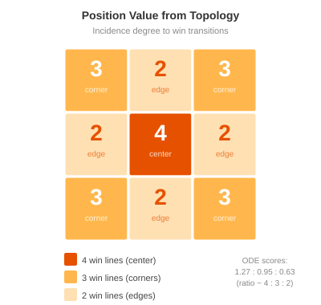

# Game Mechanics — Tic-Tac-Toe

**Learning objective**: Encode board positions, turns, and win conditions as token flow; use ODE simulation for move evaluation without game-specific heuristics.

The coffee shop modeled resources — fungible tokens flowing through recipes. This chapter models a game — structured tokens encoding board state, turn order, move history, and win detection. The Petri net is the same formalism, but the pattern is fundamentally different: a **GameNet** instead of a ResourceNet.

The central insight: strategic value emerges from model topology alone. We don't code "prefer the center" or "block two-in-a-row." The Petri net's structure — which positions participate in more winning patterns — creates these preferences automatically through the ODE dynamics. The model discovers tic-tac-toe strategy the way mass-action kinetics discovers chemical equilibrium: by following the rates.

## The Board as Places

A tic-tac-toe board has nine cells. Each cell is a place, initialized with one token meaning "available":

```
P00: 1    P01: 1    P02: 1
P10: 1    P11: 1    P12: 1
P20: 1    P21: 1    P22: 1
```

The naming convention is `P{row}{col}`, zero-indexed. `P00` is the top-left corner, `P11` is the center, `P22` is the bottom-right corner.

When a player claims a cell, the token is consumed from the position place. An empty place ($M(P_{ij}) = 0$) means the cell is occupied. This is the enabling condition in action: a move transition for cell $(i,j)$ requires $M(P_{ij}) \geq 1$. Once the token is consumed, no other transition can claim that cell. The bipartite structure of the Petri net enforces the rule "you can't play in an occupied cell" without any conditional logic.

## Turn Control via Mutual Exclusion

Tic-tac-toe alternates between X and O. A single place `Next` controls whose turn it is:

- `Next = 0` means X's turn
- `Next = 1` means O's turn

Each X move transition produces a token into `Next`:

```
P_ij  -->  PlayX_ij  -->  X_ij
                      -->  Next
```

Each O move transition consumes a token from `Next`:

```
Next  -->  PlayO_ij  -->  O_ij
P_ij  -->
```

X goes first (Next starts at 0, so O transitions are blocked). After X plays, Next becomes 1, enabling O. After O plays, Next returns to 0. The alternation is structural — no turn counter, no modular arithmetic, just a token bouncing between "available" and "consumed."

This is the same mutual exclusion pattern from the traffic intersection in Chapter 1. The `Next` token is a shared resource that enforces sequential access, exactly like the shared token that prevents both lights from being green simultaneously.

## History Places for Pattern Detection

The basic model tracks where tokens are (board state) but not where they came from (move history). Adding history places upgrades the model from "what's on the board" to "who played where."

For each cell, two history places record which player claimed it:

```
X00, X01, X02, ..., X22    (9 places — X's moves)
O00, O01, O02, ..., O22    (9 places — O's moves)
```

When X plays at position (1,1):
- Consume token from `P11` (cell becomes occupied)
- Produce token in `X11` (record X played here)
- Produce token in `Next` (pass turn to O)

When O plays at position (0,2):
- Consume token from `Next` (it's O's turn)
- Consume token from `P02` (cell becomes occupied)
- Produce token in `O02` (record O played here)

The history layer doesn't change the game mechanics — it adds information without altering what moves are legal. But it enables win detection, which needs to know not just that a cell is occupied, but *which player* occupies it.

### The Full Place Set

The complete model has 30 places:

| Category | Places | Count |
|----------|--------|-------|
| Board positions | P00–P22 | 9 |
| X history | X00–X22 | 9 |
| O history | O00–O22 | 9 |
| Turn control | Next | 1 |
| Win detection | WinX, WinO | 2 |

And a conservation constraint ties them together:

$$\sum_{i,j} M(P_{ij}) + \sum_{i,j} M(X_{ij}) + \sum_{i,j} M(O_{ij}) = 9$$

Every cell is in exactly one state: available ($P_{ij} = 1$), claimed by X ($X_{ij} = 1$), or claimed by O ($O_{ij} = 1$). The total is always 9 — the board size. This is a P-invariant of the move layer, verified by the incidence matrix; the pattern collectors of the next section deliberately break it, since a collector consumes history tokens without returning them. That breakage is the point made there.

### In the DSL

Using the struct tag syntax from Chapter 4:

```go
type TicTacToe struct {
    _ struct{} `meta:"name:tic-tac-toe,version:v1.0.0"`

    // Board positions (1 = available)
    P00 dsl.TokenState `meta:"initial:1"`
    P01 dsl.TokenState `meta:"initial:1"`
    // ... P02 through P22

    // X move history (0 = not played)
    X00 dsl.TokenState `meta:"initial:0"`
    X01 dsl.TokenState `meta:"initial:0"`
    // ... X02 through X22

    // O move history
    O00 dsl.TokenState `meta:"initial:0"`
    // ... O01 through O22

    // Turn control and win detection
    Next dsl.TokenState `meta:"initial:0"`
    WinX dsl.TokenState `meta:"initial:0"`
    WinO dsl.TokenState `meta:"initial:0"`

    // Move actions (18 total: 9 for X, 9 for O)
    PlayX00 dsl.Action `meta:""`
    PlayO00 dsl.Action `meta:""`
    // ...

    // Win detection (16 total: 8 for X, 8 for O)
    XRow0 dsl.Action `meta:""`  // X00, X01, X02
    XDg0  dsl.Action `meta:""`  // X00, X11, X22
    // ...
}
```

The flows define the arc structure:

```go
func (TicTacToe) Flows() []dsl.Flow {
    return []dsl.Flow{
        // X moves: Position -> PlayX -> History + Next
        {From: "P00", To: "PlayX00"},
        {From: "PlayX00", To: "X00"},
        {From: "PlayX00", To: "Next"},

        // O moves: Next + Position -> PlayO -> History
        {From: "Next", To: "PlayO00"},
        {From: "P00", To: "PlayO00"},
        {From: "PlayO00", To: "O00"},

        // Win detection: 3-in-a-row -> WinX
        {From: "X00", To: "XRow0"},
        {From: "X01", To: "XRow0"},
        {From: "X02", To: "XRow0"},
        {From: "XRow0", To: "WinX"},
        // ... all 8 patterns for each player
    }
}
```

The total model: 30 places, 34 transitions, 118 arcs. Every rule of tic-tac-toe — valid moves, turn alternation, win conditions — encoded purely in arc structure.

## Win Detection Without Search

Win detection is where the model becomes compositionally interesting. There are 8 winning patterns in tic-tac-toe: 3 rows, 3 columns, 2 diagonals. Each pattern is a transition that consumes three history tokens and produces a win token.

For the top row (X wins):

```
X00 --> XRow0 --> WinX
X01 -->
X02 -->
```

The transition `XRow0` is enabled when $M(X_{00}) \geq 1$ AND $M(X_{01}) \geq 1$ AND $M(X_{02}) \geq 1$ — all three top-row cells claimed by X. When it fires, it produces a token in `WinX`.

This is a **pattern collector**: a transition that recognizes a specific configuration of history tokens. Each winning pattern gets its own collector. No conditional logic, no "check all rows and columns" procedure — just 8 independent transitions, each watching for its specific three-token combination.

The 16 pattern collectors (8 for X, 8 for O) are the complete game-over detection system. When any one fires, the game has been won. Multiple can potentially fire (if a player completes two lines simultaneously), but in practice the first one to fire determines the winner.

### Why Composition Matters

Each pattern collector is independent. Adding a new win condition (say, for a variant game) means adding a new transition with three input arcs and one output arc. Removing a condition means removing a transition. The rest of the model is untouched.

The collectors are also the first place this book's core–observer split shows up. Every collector consumes three history tokens (four, once the halting fix below adds the turn token) and produces one, so its compression ratio $\rho$ — tokens consumed over tokens produced — is at least 3. The move transitions sit near $\rho = 1$: in this chapter's `Next`-as-a-bit encoding an X move consumes one token and produces two, an O move the reverse, and the pair of them is balanced; the symmetric two-turn-place encoding used on the blog makes each move exactly $\rho = 1$. That gap — balanced moves, compressing collectors — is what the tropical and zero-knowledge chapters detect as "observer". The collectors break nothing categorical: they are ordinary transitions with ordinary arcs, and they compose exactly as this section says. What they break is the one-producer-one-consumer property that the throughput analysis of Chapter 13 needs, and the uniformity of the circuit in Chapter 12. [Appendix E](appendix-e-categorical-foundations.md#where-the-free-structure-stops-two-boundaries) separates that boundary from the other one — guards — which is categorical and which tic-tac-toe does not have.

This is the compositional advantage of Petri nets over procedural game logic. In code, win detection is typically a function that iterates over patterns:

```go
winPatterns := [][]string{
    {"00", "01", "02"}, {"10", "11", "12"}, ...
}
for _, pattern := range winPatterns {
    if allMarked(pattern) { return true }
}
```

The procedural version works, but it's monolithic — changing the win conditions means changing the function. The Petri net version is modular — each pattern is an independent structural element that composes with the rest.

### Position Value from Topology

Here's the key insight that connects game structure to strategy. Each board position participates in a different number of winning patterns:

| Position | Patterns | Type |
|----------|----------|------|
| Center (1,1) | 4 | Row + Column + 2 Diagonals |
| Corners (0,0), (0,2), (2,0), (2,2) | 3 | Row + Column + 1 Diagonal |
| Edges (0,1), (1,0), (1,2), (2,1) | 2 | Row + Column |



The center participates in 4 winning patterns. Corners participate in 3. Edges participate in 2. This structural fact — encoded in the arc connectivity — is the source of strategic value. More connections to pattern collectors means more paths to victory, which the ODE dynamics translate into higher scores.

No game theory is needed to derive this. It falls directly from the net's topology.

## ODE-Guided Strategy

With the model defined, we can use the continuous relaxation to evaluate moves. The algorithm is simple:

1. For each available move, create a hypothetical state after making that move
2. Run the ODE simulation forward from that state
3. Read the final values of `WinX` and `WinO`
4. Score = my_win - opponent_win

The move with the highest score is the best move.

### The Scoring Function

```go
targetPlace := "win_x"
oppPlace := "win_o"
if currentTurn == PlayerO {
    targetPlace = "win_o"
    oppPlace = "win_x"
}

for _, move := range availableMoves {
    // Create hypothetical state
    hypState := copyState(currentState)
    hypState[position] -= 1
    hypState[historyPlace] += 1

    // Run ODE
    prob := solver.NewProblem(net, hypState,
        [2]float64{0, 3.0}, rates)
    sol := solver.Solve(prob, solver.Tsit5(), opts)
    final := sol.GetFinalState()

    // Score
    score := final[targetPlace] - final[oppPlace]
}
```

The ODE simulation with mass-action kinetics explores all possible continuations simultaneously. When X has tokens in positions that participate in many patterns, the flow toward `WinX` is higher. When O can block a pattern, that flow is diverted. The final token counts in `WinX` and `WinO` represent the aggregate outcome across all possible game continuations — weighted by their structural likelihood.

### What the ODE Discovers

**Empty board evaluation.** X evaluates all 9 positions. The ODE reveals:

- Center (1,1): score 1.27 — highest, because 4 pattern connections create the most flow toward WinX
- Corners: score 0.95 — second, 3 patterns each
- Edges: score 0.63 — lowest, 2 patterns each

The ODE has "discovered" the opening strategy: play the center. No minimax tree, no alpha-beta pruning, no opening book — just mass-action kinetics flowing through the net's topology.

**Responding to center.** After X takes center, O evaluates defensive options. All scores are negative (X has the advantage), but corners (-1.04) minimize X's lead better than edges (-1.38). The ODE discovers the defensive principle: play corners against center.

**Finding winning threats.** When X has center and a corner, the ODE identifies the opposite corner as the best move (score 1.39) because it creates a two-way threat — a fork that completes one diagonal while opening another. The pattern collectors naturally amplify fork positions because they have higher connectivity.

**Blocking.** When X has two in a row, O's best move is the blocking position (score 0.80 vs. 0.74-0.77 for other moves). The ODE discovers blocking because the flow toward WinX is dramatically higher along the threatened pattern. Placing a token to block cuts off that flow.

### Performance

Each move evaluation requires one ODE solve. With 9 possible moves on an empty board, that's 9 solves. Using tuned solver options:

```go
opts := &solver.Options{
    Dt:     0.2,
    Reltol: 1e-3,
}
```

Each solve takes roughly 4 milliseconds, making a full game (about 45 total evaluations across all moves) complete in about 1.8 seconds. Fast enough for interactive play.

### ODE vs. Random: Results

Running the ODE AI against a random player over many games:

| Matchup | X Wins | O Wins | Draws |
|---------|--------|--------|-------|
| ODE vs Random | ~95% | ~2% | ~3% |
| Random vs ODE | ~15% | ~70% | ~15% |
| ODE vs ODE | ~10% | ~5% | ~85% |

The ODE AI dominates random play. When both players use ODE evaluation, the game usually draws — the correct outcome for optimal play. The model, without any game-specific heuristics, approximates optimal strategy.

## Game Halting and Draw Detection

A subtle but critical detail: what happens when a player wins? In the basic model, tokens continue flowing after a win — the ODE doesn't know the game should stop. This distorts strategic values because the simulation averages over impossible continuations.

The fix is **game halting**: win transitions consume the turn token without returning it.

```
X00 --> XRow0 --> WinX
X01 -->
X02 -->
Next -->             (consume turn -- game stops)
```

When X wins, the `XRow0` transition consumes `Next` (it was O's turn). No turn token is returned. All further move transitions are blocked because they require either an empty position token or a turn token, and the turn token is gone. The win state becomes an **absorbing state** — once reached, no further flow is possible.

### Draw Detection

Draw detection adds a move counter. Each play transition deposits a token into `move_tokens`. A `draw` transition fires when:
- 9 move tokens have accumulated (all squares filled)
- `game_active` is still marked (no winner)

The draw transition awards a point to `WinO`, encoding the principle that "a draw is a win for the defender." This changes the ODE dynamics:

**Without draw detection:** O's scores are always negative. The model only sees win paths, so it favors positions with more winning lines even when blocking is essential.

**With draw detection:** O's scores become positive because draws count as partial victories. Blocking a threat now has measurable value — it preserves the possibility of a draw, which has positive worth.

## The Integer Reduction

The ODE scores from the empty board — center 1.27, corners 0.95, edges 0.63 — are suspiciously proportional. Divide each by the smallest:

$$1.27 : 0.95 : 0.63 \approx 4 : 3 : 2$$

The ODE is tracking three integers. Not computing them exactly — the ratios are approximate, within a few percent — but recovering the same ranking and grouping that the integers predict.

### Incidence Degree to Terminals

The win transitions in this model are **terminal** — they are sinks in the net. The number of arcs from a position's history place to downstream win transitions is its **incidence degree**. This is a graph property — count the arcs, get an integer. No simulation needed.

| Position | Win patterns | Incidence degree |
|----------|-------------|-----------------|
| Center (1,1) | Row + Column + 2 Diagonals | 4 |
| Corners (0,0), (0,2), (2,0), (2,2) | Row + Column + 1 Diagonal | 3 |
| Edges (0,1), (1,0), (1,2), (2,1) | Row + Column | 2 |

The full board heatmap is `[3, 2, 3, 2, 4, 2, 3, 2, 3]`. The strategic value of a position in a game with terminal win states is determined by its incidence degree to those terminals. The ODE recovers this ranking through dynamics; the graph gives it directly.

### Generalizing to Any Board Size

The incidence degree formula works for any $n \times n$ board. Each position at $(i, j)$ gets:

- 2 (its row + its column), always
- +1 if on the main diagonal ($i = j$)
- +1 if on the anti-diagonal ($i + j = n - 1$)

So the only possible degrees are {4, 3, 2}, and degree 4 only occurs at the center of odd-sized boards. Running the ODE with uniform rates across board sizes from 3×3 to 7×7 confirms that the same predictive behavior holds at every scale:

- Positions with the same incidence degree always receive the same ODE score
- Higher incidence degree always produces a higher score
- The ranking center > diagonal > non-diagonal is preserved

The ODE ratios approximate the integer ratios closely for small boards (~2% error at 3×3) and less closely for larger ones (~10% at 7×7), because more positions compete for flow through shared win transitions. But the ranking — which is what matters for move selection — never changes. The incidence degree is an exact predictor of ODE ranking for all tested board sizes.

### Dynamic Evaluation: Injecting Current State

The empty board is the easy case. The real utility comes from injecting the current game state as the marking and recomputing.

When a position is occupied, its token has been consumed — it drops out of the calculation. The incidence degree is now computed only against still-reachable win transitions. A corner that participates in 3 win patterns on an empty board might participate in only 1 if the opponent has blocked the other two. The heatmap updates to reflect the live topology.

This is the general "next step" evaluator. Given any board state:

1. Identify which win transitions are still reachable (not blocked by opponent pieces)
2. For each empty position, count the number of reachable win transitions it connects to
3. The highest count is the best move

No search tree, no minimax, no alpha-beta pruning — just count the edges to live terminals.

### The Boundary Between Counting and Simulation

Tic-tac-toe reduces to `{4, 3, 2}` precisely because it is simple enough that topology is all you need. The win transitions are independent sinks. No position participates in resource competition with another. The incidence structure has no interesting dynamics — just a direct count.

For more complex games — poker with its multi-phase betting structure, or governance models with competing resource flows — the incidence structure is rich enough that positions do not reduce to small integers. Multiple paths interact, resource constraints create bottlenecks, and the dynamics through the net have real work to do. The ODE earns its keep in those cases.

But the mechanism is identical:

1. Model the system as a Petri net with terminal (win/loss/goal) transitions
2. Inject the current state as the marking
3. Compute the evaluation from token flow to reachable terminals

For simple nets, step 3 is integer counting. For complex nets, step 3 is ODE simulation. The boundary between them is the boundary between systems where topology alone determines strategy and systems where dynamics matter.

What we have is a **static evaluation function defined purely by net topology and current state**. No heuristics, no training data, no game-specific knowledge beyond the Petri net model itself. For any game or system modeled as a Petri net with designated terminal states, the function is: *for each position, how connected is it to winning?* The Petri net is the domain knowledge — the topology encodes the rules, and the incidence structure encodes the strategy.

## The GameNet Pattern

Tic-tac-toe demonstrates the GameNet pattern from Chapter 4:

1. **Board state as places** — each cell is a place, tokens mark availability
2. **Move history as places** — separate tracking of who played where
3. **Turn control as a shared token** — mutual exclusion enforces alternation
4. **Pattern collectors as transitions** — compositional win detection
5. **ODE scoring** — strategic value emerges from topology
6. **Integer reduction** — for simple games, the ODE collapses to incidence degree counting

The same pattern scales to more complex games. A Connect Four model would have 42 position places (7 columns × 6 rows) and more pattern collectors (horizontal, vertical, diagonal sequences of 4). A Go model would have 361 position places. The complexity is in the number of places and patterns, not in the logic — the logic is always the same: tokens flow, patterns collect, scores emerge. And when the game is simple enough, the scores are integers you can read off the graph without running the solver at all.

The mathematical foundation is identical to the coffee shop. The incidence matrix encodes all arcs. Conservation laws guarantee no tokens are created or destroyed. The ODE simulation finds the natural flow. The difference is interpretation: in the coffee shop, tokens are grams of beans; in tic-tac-toe, tokens are board positions and move records. The mathematics doesn't care.

> **Try it live:** Play against the ODE solver in the [Tic-Tac-Toe demo](https://pilot.pflow.xyz/tic-tac-toe/) or try the [ZK variant](https://pilot.pflow.xyz/zk-tic-tac-toe/) for privacy-preserving moves at [pilot.pflow.xyz](https://pilot.pflow.xyz/).

The next chapter applies Petri nets to constraint satisfaction — modeling Sudoku as a system where arc weights and conservation laws enforce the puzzle's rules, and the ODE relaxation finds valid configurations. Chapter 13 returns to the integer reduction from a different angle: deriving rate constants automatically from graph connectivity, and feeding them directly into the ZK verification pipeline.
